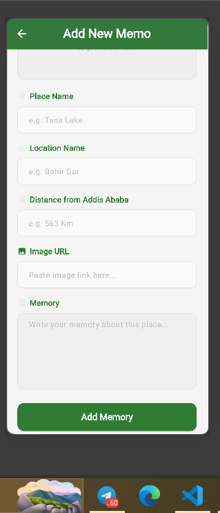
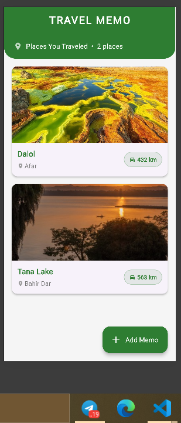
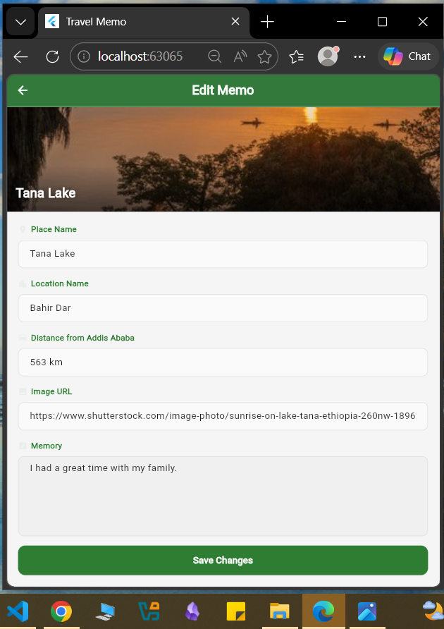
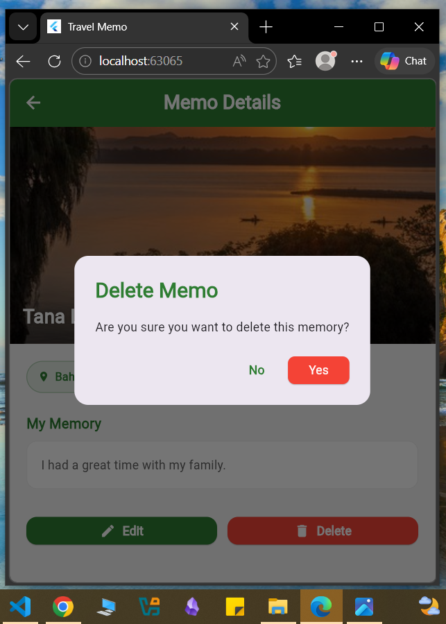
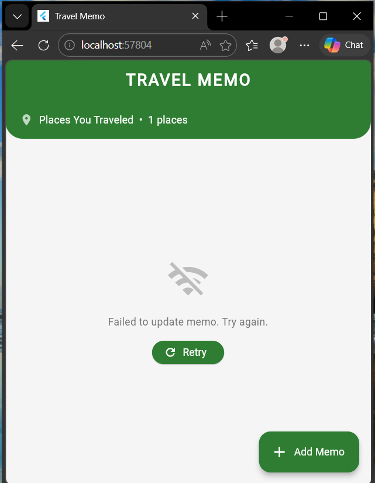
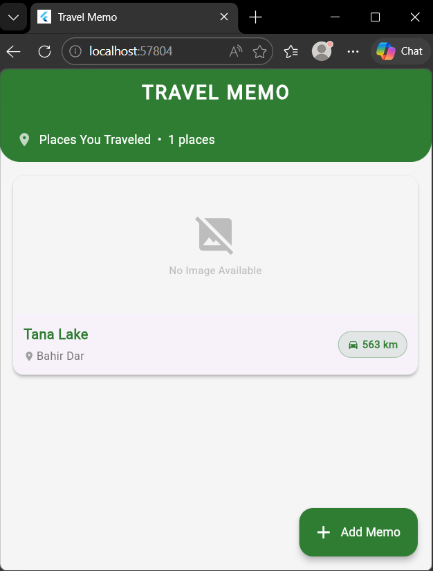
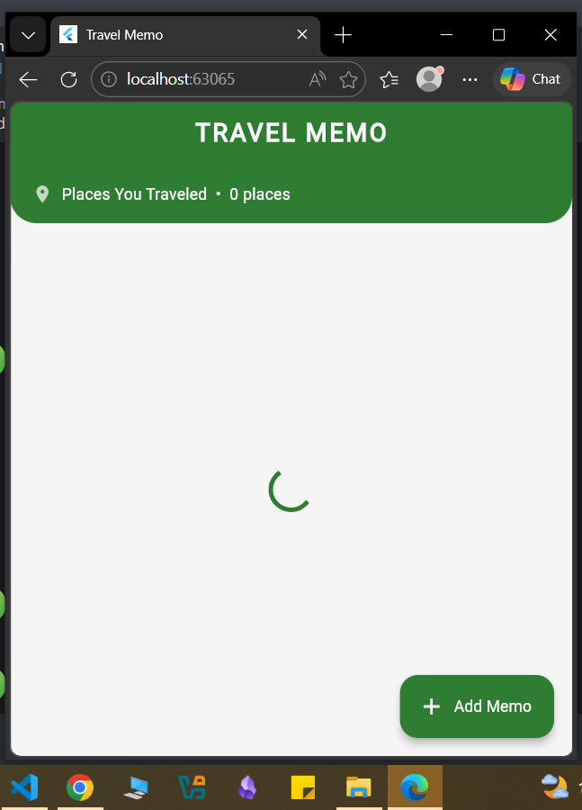

# Travel Memo App

A Flutter mobile application that allows users to record and manage their travel memories using full CRUD operations.

## Features

**Create** : Add a new travel memory with place name, location, distance, image, and personal memory.

**Read** : View all travel memories in a clean card-based home screen.

**Update** : Edit any existing travel memory.

**Delete** : Remove a memory with a confirmation dialog.

## Error Handling

- Network error message with retry button

- Image error placeholders

- Empty state when no memos exist
- Form validation on all input fields
- Success and failure snackbars for all actions

## Loading states

- Loading spinner while fetching data

-This app uses [JSONPlaceholder](https://jsonplaceholder.typicode.com)
as the public REST API.
-It Use the latest Provider state management solution for state management and the http package for making network requests.
